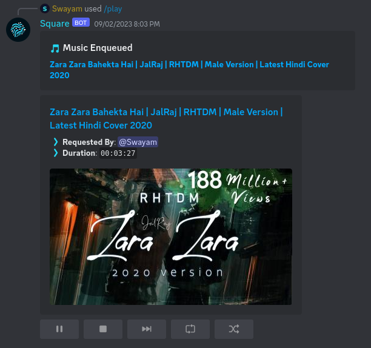
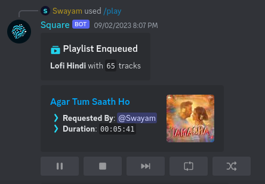
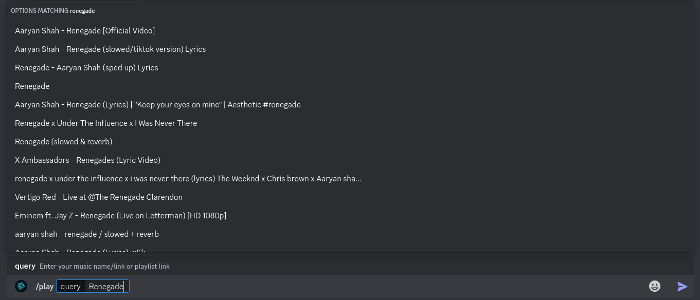

<div align="center">


Advance multipurpose discord bot for all your needs

</div>

## 🎬️ Preview

- **YouTube Player**

    

- **Spotify Player**

    

- **Music Search**

    

## 🎯 Features

- Advance moderation system
- Lots of utility & fun commands
- Advance music system with control system
- Clean & informative help menu

## 🚀 Installation

1. Clone this repository
    ```sh
    git clone <repository url> square_bot
    cd square_bot
    ```

2. Install dependencies
    ```sh
    python -m venv .venv
    source .venv/bin/activate
    pip install -r requirements.txt
    ```

3. Configure the [`config.json`](./configs/config.json) file
    <details>

    <summary>Configuration</summary>

    - `owner_id` (`int`) [Required]
        - Owner's discord id
        - Gives access to all commands

    - `dev_ids` (`List[int]`) [Required]
        - Developer's discord ids
        - Gives access to developer commands
        - *This can be managed by `/list-devs`, `/add-dev`, `/remove-dev` commands too*

    - `lockdown` (`bool`) [Required]
        - Lockdown status
        - If true, bot will not respond to any commands in any guild except owner's guilds
        - *This can be toggled by `/lockdown` command*

    - `owner_guild_ids` (`List[int]`) [Required]
        - List of guild ids
        - Developer commands will only work in these guilds

    - `system_ch_id` (`int`) [Required]
        - System channel id
        - Bot will send logs in this channel

    - `support_server_url` (`str`) [Required]
        - Support server url
        - Bot will use this url for support server

    - `discord_api_token` (`str`) [Required]
        - Discord api token
        - Bot will use this token to connect to discord

    - `openai_api_token` (`str`) [Required]
        - OpenAI api token
        - Bot will use this token to connect to openai

    - `lavalink` (`Dict[str, Union[str, int]]`) [Required]
        - `host` (`str`) [Required]
            - Lavalink host
        - `port` (`int`) [Required]
            - Lavalink port
        - `pass` (`str`) [Required]
            - Lavalink password

    - `datetime_format` (`str`) [Optional]
        - Datetime format
        - Bot will use this format to display datetime

    </details>

4. Start the bot
    ```sh
    source .venv/bin/activate
    python main.py
    ```
