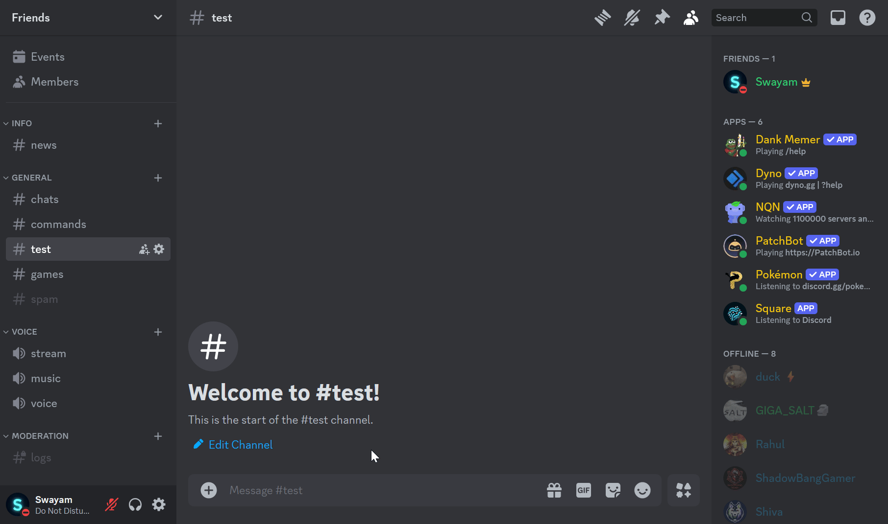

<div align="center">


Advanced multipurpose discord bot for all your needs

</div>

## 🎬️ Preview

- **Moderation System**

    

- **Music Player**

    

- **Ticket System**

    

## 🎯 Features

- Advanced moderation system
- Lots of utility & fun commands
- Advanced music system with control system
- Clean & informative help menu

## 🚀 Installation

1. Clone this repository
    ```sh
    git clone https://github.com/swayam25/Square-Bot square_bot
    cd square_bot
    ```

2. Rename the [`config.json.example`](./configs/config.json.example) file to `config.json`.

3. Configure the `config.json` file
    <details>

    <summary>Configuration</summary>

    - `owner_id` (`int`) [Required]
        - Owner's discord id
        - Gives access to all commands

    - `dev_ids` (`List[int]`) [Required]
        - Developer's discord ids
        - Gives access to developer commands
        - *This can be managed by `/dev list`, `/dev add` & `/dev remove` commands too*

    - `lockdown` (`bool`) [Required]
        - Lockdown status
        - If true, bot will not respond to any commands in any guild except owner's guilds
        - *This can be toggled by `/lockdown` command*

    - `owner_guild_ids` (`List[int]`) [Required]
        - List of guild ids
        - Developer commands will only work in these guilds

    - `system_ch_id` (`int`) [Required]
        - System channel id
        - Bot will send logs in this channel

    - `support_server_url` (`str`) [Required]
        - Support server url
        - Bot will use this url for support server

    - `discord_api_token` (`str`) [Required]
        - Discord api token
        - Bot will use this token to connect to discord

    - `lavalink` (`Dict[str, Union[str, int]]`) [Required]
        - `host` (`str`) [Required]
            - Lavalink host
        - `port` (`int`) [Required]
            - Lavalink port
        - `pass` (`str`) [Required]
            - Lavalink password
        - `secure` (`bool`) [Required]
            - Lavalink secure status

    </details>

4. Set emojis in [`emoji.json`](./configs/emoji.json) file. If you want to use default emojis, you can change the `emoji_file_path` to `./configs/default_emoji.json` in [`emoji.py`](./utils/emoji.py) file


5. Install dependencies
    ```sh
    python -m venv .venv
    source .venv/bin/activate
    pip install -r requirements.txt
    ```

6. Start the bot
    ```sh
    python main.py
    ```
## 🌐 Production

1. Follow steps 1-4 from the [installation guide](#-installation). *Ignore if already done.*

2. Build docker image
    ```sh
    docker build -t square .
    ```

3. Run docker container
    ```sh
    docker run --name square -v ./database/:/square/database:rw -d square
    ```
