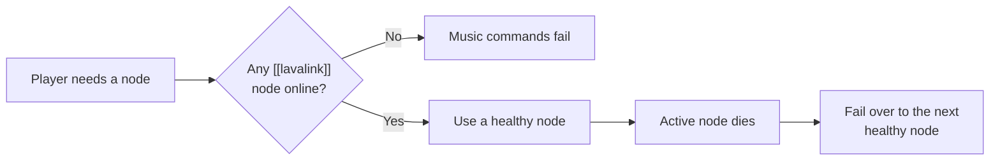
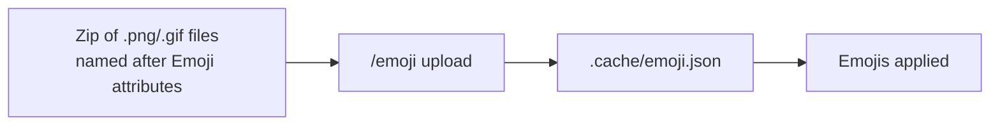

<div align="center">


# Square Bot

Advanced multipurpose discord bot for all your needs.

[](https://www.python.org/downloads)
[](https://github.com/Pycord-Development/pycord)
[](https://github.com/swayam25/Square-Bot/releases)
[](https://github.com/swayam25/Square-Bot/blob/main/LICENSE)

</div>

## 🎯 Features

- Music with player controls, DJ roles with vote skip, multi-node failover, smart autoplay, audio filters and much more!
- Auto-mod, mass moderation, tickets & detailed logging.
- Custom emojis synced from a simple `.zip` upload.
- Fully dockerized, deploys with a single `just prod` command.

## 💫 Prerequisites

| Tool                                                                                                                                    | Version | Purpose                                             |
| --------------------------------------------------------------------------------------------------------------------------------------- | ------- | --------------------------------------------------- |
| [](https://www.docker.com/) | 20.10+  | To run the bot in a containerized environment.      |
| [](https://git-scm.com/)             | 2.50+   | To clone the repository and manage version control. |
| [](https://github.com/casey/just) | 1.27+   | A command runner for the project's recipes.         |

## 🚀 Production

1. Clone the repository
    ```sh
    git clone https://github.com/swayam25/Square-Bot square
    cd square
    ```

2. Create `config.toml` file from the provided `config.example.toml` and fill in the required values.
    ```sh
    cp config.example.toml config.toml
    ```

> [!TIP]
> Check [configuration](#-configuration) section for details on the configuration keys.

3. Build the image and start the stack
    ```sh
    just prod
    ```

4. Done! The bot and its Postgres database are up. `just prod` pulls the latest code, rebuilds, and redeploys; `just prod --down` stops everything.

> [!NOTE]
> The production stack is only the bot and its Postgres database. It has no web UI and exposes no ports. Logs go to stdout (`docker compose -f docker-compose.prod.yml logs -f bot`); any monitoring or database tooling is yours to add.

## 🪇 Setup Lavalink

The bot needs at least one [Lavalink](https://github.com/lavalink-devs/Lavalink) node to play music. Nodes are configured as `[[lavalink]]` tables in `config.toml`, you can add more than one and the bot fails over to a healthy node if one dies.


```mermaid
flowchart LR
    A["Player needs a node"] --> B{"Any [[lavalink]]<br/>node online?"}
    B -- No --> C["Music commands fail"]
    B -- Yes --> D["Use a healthy node"]
    D --> E["Active node dies"]
    E --> F["Fail over to the next<br/>healthy node"]
```

### [Option 1] Use a free public node

There's a [community-maintained list](https://lavalink.darrennathanael.com) of free public Lavalink nodes. Pick one and drop its host/port/password into a `[[lavalink]]` table.

> [!WARNING]
> Public nodes are shared with everyone else using that list. Expect rate limits, downtime, and credentials that rotate or die without notice.
>
> Fine for a quick test, not something to rely on for production.

### [Option 2] Self-host your own node (*recommended*)

Running your own node gives you full control over performance, uptime, and audio sources. See the [Lavalink docs](https://lavalink.dev) for setup.

> [!NOTE]
> Lavalink is a separate service, it isn't bundled in this repo's `docker-compose` files. Run it on its own (same host or elsewhere) and point a `[[lavalink]]` table at it.

> [!WARNING]
> It's best to host Lavalink on a **different VPS** than the one running the bot itself. Most big-name cloud providers (AWS, GCP, Azure, DigitalOcean, etc.) have their IP ranges rate-limited or blocked by YouTube, so playback breaks even though the node itself is perfectly healthy. A smaller, less popular host tends to dodge this.

## 🔑 Configuration

| Key                  | Type        | Description                                                                                                       |
| -------------------- | ----------- | ----------------------------------------------------------------------------------------------------------------- |
| `owner-id`           | `int`       | The Discord ID of the bot owner.                                                                                  |
| `owner-guild-ids`    | `list[int]` | A list of Discord IDs of the owner's guilds. Owner/Developer only commands are created only in these guilds.      |
| `system-channel-id`  | `int`       | The Discord ID of the system channel where the bot will send startup, guild join/leave etc... messages.           |
| `support-server-url` | `str`       | The invite URL of the support server.                                                                             |
| `bot-token`          | `str`       | Discord Bot Token. Get this from developer portal.                                                                |
| `database-url`       | `str`       | The URL for the PostgreSQL database.                                                                              |
| `colors.theme`       | `str`       | The color theme for the bot's view containers.                                                                    |
| `colors.green`       | `str`       | The color code for green color in view containers.                                                                |
| `colors.red`         | `str`       | The color code for red color in view containers.                                                                  |
| `colors.orange`      | `str`       | The color code for orange color in view containers.                                                               |
| `[[lavalink]]`       | `table`     | A Lavalink node. Multiple `[[lavalink]]` tables can be configured, players fail over to another node if one dies. |
| `lavalink.host`      | `str`       | The host of the Lavalink server.                                                                                  |
| `lavalink.port`      | `int`       | The port of the Lavalink server.                                                                                  |
| `lavalink.password`  | `str`       | The password for the Lavalink server.                                                                             |
| `lavalink.secure`    | `bool`      | Whether to use secure connection (wss) for Lavalink.                                                              |

## ✨ Custom Emojis

The bot ships with a default set of Unicode emojis defined on the `Emoji` class in [`emoji.py`](./utils/emoji.py). You can override any of these with your own Discord custom emojis.

**How it works:** every emoji is keyed by an attribute name on the `Emoji` class (*e.g. `success`, `error`, `loading`*). The bot loads overrides from `.cache/emoji.json`, matching each entry to an attribute by name. Any attribute without an override simply falls back to its default.

There are two ways to provide overrides - upload a `.zip`, or write `.cache/emoji.json` by hand.

### [Option 1] Upload a `.zip` (*recommended*)

The workflow is the same whether you use the emojis bundled with this bot or your own:

1. **Prepare a `.zip`** of `.png`/`.gif` emoji files. Each file name **must** match an attribute on the `Emoji` class (*e.g. `success.png` → the `success` attribute*).
    > To use the bot's built-in set, just grab the ready-made [`emojis.zip`](./assets/emojis.zip).
1. **`/emoji upload`**: Upload the `.zip` to register the emojis with Discord.


```mermaid
flowchart LR
    A["Zip of .png/.gif files<br/>named after Emoji attributes"] --> B["/emoji upload"]
    B --> C[".cache/emoji.json"]
    C --> D["Emojis applied"]
```

### [Option 2] Write `.cache/emoji.json` manually

If you already have the emojis, you can skip uploading and create `.cache/emoji.json` yourself:

```json
{
    "emoji_name": "<a:dc_emoji_name:dc_emoji_id>",
    "emoji_name": "<:dc_emoji_name:dc_emoji_id>"
}
```

| Field                | Meaning                                                           |
| -------------------- | ----------------------------------------------------------------- |
| `emoji_name`         | The attribute name on the `Emoji` class this override maps to.    |
| `<a:...>` / `<:...>` | `<a:...>` is an **animated** emoji, `<:...>` is a **static** one. |
| `dc_emoji_name`      | The emoji's name as it appears in Discord.                        |
| `dc_emoji_id`        | The emoji's unique Discord ID.                                    |

## ❤️ Contributing

Contributions are welcome! See [CONTRIBUTING.md](./CONTRIBUTING.md) for how to get a local copy running and what we look for in a pull request.
